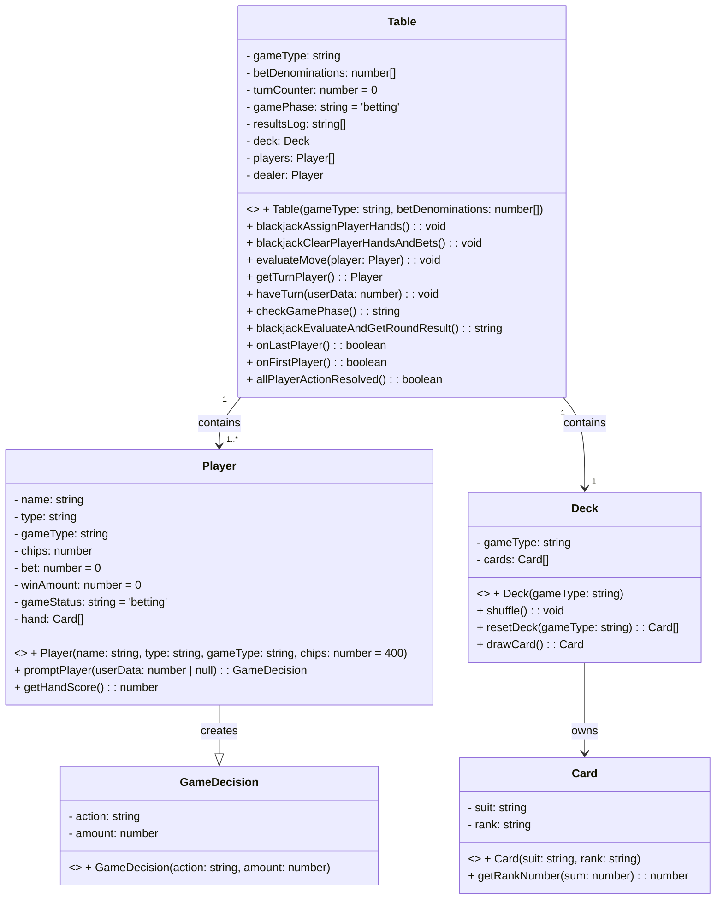

# Blackjack

| Class | Property | Description |
| --- | --- | --- |
| Table | `gameType: string` | ゲームの種類を表す文字列 |
|       | `betDenominations: number[]` | ベットの額を格納する数値の配列 |
|       | `turnCounter: number` | ターンのカウンター、初期値は0 |
|       | `gamePhase: string` | ゲームフェーズを表す文字列、初期値は 'betting' |
|       | `resultsLog: string[]` | ゲーム結果を記録する文字列の配列 |
|       | `deck: Deck` | ゲームのデッキを表すDeckクラスのインスタンス |
|       | `players: Player[]` | プレイヤーを格納するPlayerクラスのインスタンスの配列 |
|       | `dealer: Player` | ディーラーを表すPlayerクラスのインスタンス |
|       | <<constructor>> `Table(gameType: string, betDenominations: number[])` | コンストラクタ。gameTypeとbetDenominationsを受け取り、Tableオブジェクトを初期化する。 |
|       | `blackjackAssignPlayerHands(): void` | プレイヤーにカードを配るメソッド。 |
|       | `blackjackClearPlayerHandsAndBets(): void` | プレイヤーの手札とベットをクリアするメソッド。 |
|       | `evaluateMove(player: Player): void` | プレイヤーのアクションを評価し、ゲームの進行状態を変更するメソッド。 |
|       | `getTurnPlayer(): Player` | ターン中のプレイヤーを取得するメソッド. |
|       | `haveTurn(userData: number): void` | プレイヤーのターンを処理するメソッド. |
|       | `checkGamePhase(): string` | ゲームフェーズをチェックし、'roundOver'または'acting'を返すメソッド. |
|       | `blackjackEvaluateAndGetRoundResult(): string` | ラウンド結果を評価し、結果を文字列として返すメソッド. |
|       | `onLastPlayer(): boolean` | ターンが最後のプレイヤーかどうかを判定するメソッド. |
|       | `onFirstPlayer(): boolean` | ターンが最初のプレイヤーかどうかを判定するメソッド. |
|       | `allPlayerActionResolved(): boolean` | すべてのプレイヤーのアクションが解決されたかどうかを判定するメソッド. |
| --- | --- | --- |
| GameDecision | `action: string` | アクションを表す文字列 |
|              | `amount: number` | 金額を表す数値 |
|              | <<constructor>> `GameDecision(action: string, amount: number)` | コンストラクタ。actionとamountを受け取り、GameDecisionオブジェクトを初期化する. |
| --- | --- | --- |
| Player | `name: string` | プレイヤーの名前 |
|        | `type: string` | プレイヤーの種類を表す文字列 |
|        | `gameType: string` | ゲームの種類を表す文字列 |
|        | `chips: number` | プレイヤーのチップ数 |
|        | `bet: number` | プレイヤーのベット額、初期値は0 |
|        | `winAmount: number` | プレイヤーの獲得額、初期値は0 |
|        | `gameStatus: string` | プレイヤーのゲーム状態を表す文字列、初期値は 'betting' |
|        | `hand: Card[]` | プレイヤーの手札を格納するCardクラスのインスタンスの配列 |
|        | <<constructor>> `Player(name: string, type: string, gameType: string, chips: number = 400)` | コンストラクタ。name、type、gameType、chipsを受け取り、Playerオブジェクトを初期化する. |
|        | `promptPlayer(userData: number | null): GameDecision` | プレイヤーにアクションを促すメソッド. userDataはプレイヤーの手札の合計点数を表す数値. |
|        | `getHandScore(): number` | プレイヤーの手札の合計点数を計算するメソッド. |
| --- | --- | --- |
| Deck | `gameType: string` | ゲームの種類を表す文字列 |
|      | `cards: Card[]` | カードのデッキを表すCardクラスのインスタンスの配列 |
|      | <<constructor>> `Deck(gameType: string)` | コンストラクタ。gameTypeを受け取り、Deckオブジェクトを初期化する. |
|      | `shuffle(): void` | カードデッキをシャッフルするメソッド. |
|      | `resetDeck(gameType: string): Card[]` | カードデッキをリセットし、初期化状態に戻すメソッド. |
|      | `drawCard(): Card` | カードを1枚ドローするメソッド. |
| Class | Property | Description |
| --- | --- | --- |
| Card | `suit: string` | カードのスート（マーク）を表す文字列 |
|      | `rank: string` | カードのランク（数字または絵札）を表す文字列 |
|      | <<constructor>> `Card(suit: string, rank: string)` | コンストラクタ。suitとrankを受け取り、Cardオブジェクトを初期化する. |
|      | `getRankNumber(sum: number): number` | カードのランクを数値に変換するメソッド. sumは現在の合計点数を表す数値. |

